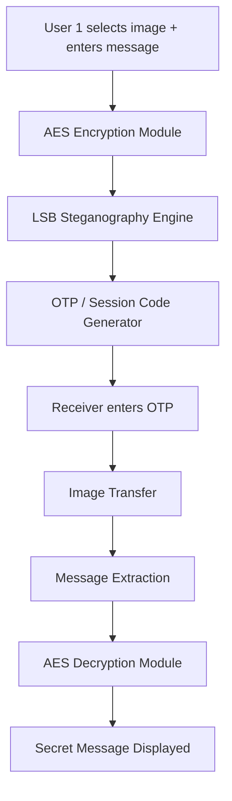

Project Name : StegoSend — Secure Browser-Based Message Transfer using AES + Image Steganography

key points:
1.AES encryption
Message is protected even before hiding.
2.Image steganography using LSB
Encrypted message is hidden inside the image.
3.OTP-based transfer system
User 1 gets a code, User 2 enters it and downloads/receives the encoded image.

StegoSend is a web-based application that enables secure communication using steganography and encryption. It allows users to hide encrypted messages inside images and share them using a one-time code (OTP), similar to file-sharing platforms like Send Anywhere.

How It Works?
User selects an image and enters a secret message
Message is encrypted using AES
Encrypted message is embedded into the image using LSB technique
A unique OTP/session code is generated
Receiver enters the OTP to access the encoded image
Hidden message is extracted and decrypted

Tech Stack
Frontend: HTML, CSS, JavaScript
Backend: Flask (Python)
Encryption: AES (cryptography library)
Image Processing: Pillow
Storage: Temporary (in-memory / SQLite)

